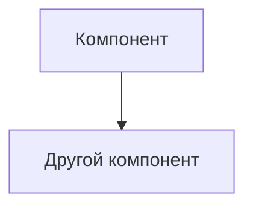

# ADR-1: Уровень 1

**Статус:** ✅ Принято | ⚠️ На рассмотрении | ❌ Отклонено  
**Участники:** <Имена и роли>  
**Дата:** <ГГГГ-ММ-ДД>

---

## 1. Контекст

<Опишите проблему или возможность, которые привели к этому решению. Включите технический и бизнес-контекст>

---

## 2. Требования

### Функциональные

<Используйте один из форматов>

**FURPS+**:

| Категория          | Требование                                                                                                                                                                                                                                                                                                                                                                                                                                                                                                                                                                                                                                                                                                                                                                                                                                                                                                                                                                                                                                                                                                                                                                                                                                                                                                                                                                                                                                                                        |
|--------------------|-----------------------------------------------------------------------------------------------------------------------------------------------------------------------------------------------------------------------------------------------------------------------------------------------------------------------------------------------------------------------------------------------------------------------------------------------------------------------------------------------------------------------------------------------------------------------------------------------------------------------------------------------------------------------------------------------------------------------------------------------------------------------------------------------------------------------------------------------------------------------------------------------------------------------------------------------------------------------------------------------------------------------------------------------------------------------------------------------------------------------------------------------------------------------------------------------------------------------------------------------------------------------------------------------------------------------------------------------------------------------------------------------------------------------------------------------------------------------------------|
| **F**unctional     | **Функциональные требования к системе** Система должна:<ul><li>фиксировать признаки беспокойного поведения или драк среди животных и оповещать оператора</li><li>фиксировать признаки задавливания поросят</li><li>управлять кормушками и поилками разных производителей</li><li>оценивать состояние животных по внешнему виду и поведению: болезнь, гибель, беспокойство и так далее</li><li>следить за состоянием систем фильтрации воды</li><li>пересчитывать поголовье</li><li>следить за запасами еды и прогнозировать расход</li><li>делать пересчёт животных</li><li>поддерживать необходимое количество видеокамер для аналитики в реальном времени от разных производителей</li><li>быть построена по принципу «центральный сервер — агенты» на конкретных фермах без ограничения количества таких агентов (в синхронизации между агентами и центральным сервером допускается задержка до 10 минут без учёта проблем со связью)</li><li>предоставлять базовые метрики для передачи в другие системы</li><li>поддерживать возможность добавления собственных метрик</li><li>работать даже в случае отсутствия интернета и при необходимости отправлять уведомления дежурному сотруднику на местах мониторинга, а после восстановления связи синхронизироваться с центральной системой</li><li>иметь разделение ролей и поддерживать современные способы аутентификации и авторизации</li><li>иметь API для создания мобильного приложения или веб-приложения</li></ul> |
| **U**sability      | **Требования к UX/UI** Система должна:<ul><li>Иметь удобный интерфейс для сотрудникво фермы</li><li>Поддерживать русский язык</li></ul>                                                                                                                                                                                                                                                                                                                                                                                                                                                                                                                                                                                                                                                                                                                                                                                                                                                                                                                                                                                                                                                                                                                                                                                                                                                                                                                               |
| **R**eliability    | **Требования к надежности** Система должна:<ul><li> Иметь отказоустойчивость 99,95%</li><li>[Добавить требования к резервированию данных]</li><li>[Добавить требования к времени восстановления]</li></ul>                                                                                                                                                                                                                                                                                                                                                                                                                                                                                                                                                                                                                                                                                                                                                                                                                                                                                                                                                                                                                                                                                                                                                                                                                                                                    |
| **P**erformance    | **Требования к производительности** Система должна:<ul><li>оповещать сотрудника о нештатной ситуации в течение 5 секунд</li><li>позволять системе видеоаналитики реагировать в реальном времени (миллисекунды).</li><li>[Добавить требования к поддержке нагрузки]</li></ul>                                                                                                                                                                                                                                                                                                                                                                                                                                                                                                                                                                                                                                                                                                                                                                                                                                                                                                                                                                                                                                                                                                                                                                                                  |
| **S**upportability | **Требования к сопровождению** Система должна:<ul><li>[Добавить требования к документации]</li><li>[Добавить требования к обновлениям]</li><li>[Добавить требования к мониторингу и логированию]</li></ul>                                                                                                                                                                                                                                                                                                                                                                                                                                                                                                                                                                                                                                                                                                                                                                                                                                                                                                                                                                                                                                                                                                                                                                                                                                                                    |

[//]: # (**Или Use Cases**:)

[//]: # (| UC-ID | Название | Основной поток | Альтернативные потоки |)

### Нефункциональные

| Категория          | Требование                                                                                                                                                                                                                                  | Критичность |
|--------------------|---------------------------------------------------------------------------------------------------------------------------------------------------------------------------------------------------------------------------------------------|-------------|
| Отказоустойчивость | обеспечивать достаточно высокую отказоустойчивость 99,95%                                                                                                                                                                                   | Высокая     |
| Расширяемость      | быть расширяемой, то есть иметь возможность разработать новый функционал без изменений существующего                                                                                                                                         | Средняя     |
| Производительность | от момента возникновения нештатной ситуации, зафиксированной с помощью видеоаналитики, должно проходить не более 5 секунд до момента оповещения                                                                                             | Высокая     |
| Видеоаналитика     | позволять системе видеоаналитики реагировать в реальном времени (миллисекунды)                                                                                                                                                              | Высокая     |
| Нейронные сети     | часто нейронные сети путают тень животного с самим животным — для MVP не критично; проблемы с освещением — камеры должны уметь снимать и в ночное время суток; трекинг животных сложен, так как особи очень похожи; готовую нейросетевую модель предоставят партнёры | Средняя     |
| Инфраструктура     | на ферме нестабильный WiFi, поэтому нужно продумать альтернативные каналы связи; покрытие камерами всей площади — нужно убрать слепые зоны либо использовать камеры типа «рыбий глаз», но это снижает качество; на каждой ферме допустимо использовать один центральный сервер и необходимый набор edge-устройств | Высокая     |

---

## 3. Решение

### Описание

<Детальное описание решения с диаграммами при необходимости>

### Аргументация

| Критерий | Обоснование |
|----------|-------------|
|          |             |

#### Последствия

**✅ Положительные:**
- 

-

**⚠️ Негативные:**
- 

-

**↗️ Зависимости:**
- 

---

### 4. Альтернативы

| Вариант | Плюсы | Минусы | Почему отклонен |
|---------|-------|--------|-----------------|
|         |       |        |                 |

---

### 5. Риски

1. **<Название риска>**  
   *Меры:*

2. **<Название риска>**  
   *Меры:*

3. **<Название риска>**  
   *Меры:* 