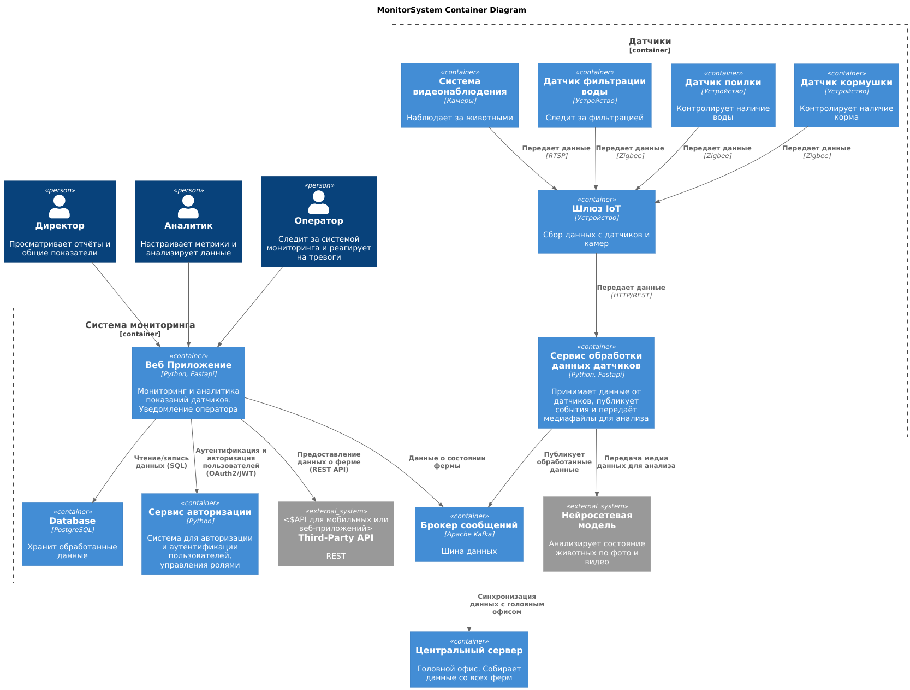
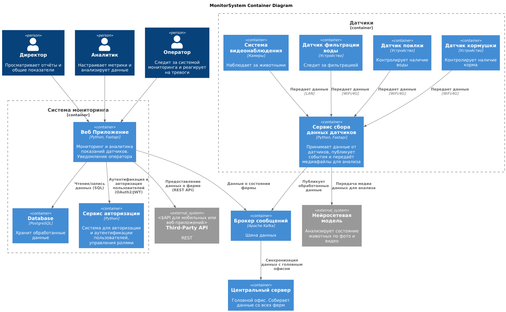

### **Название задачи: Разработка вариантов решений**

### **Автор: Вадим Волковский**

### **Дата: 30.09.25**

### **Функциональные требования**

Опишите здесь верхнеуровневые Use Cases. Их нужно оформить в виде таблицы с пошаговым описанием.

| **№** | **Действующие лица или системы**                                            | **Use Case**                                                       | **Описание (пошагово)**                                                                                                                                                                                                                                                                                                                                           |
| :----: | :--------------------------------------------------------------------------------------------------- | :----------------------------------------------------------------- | :-------------------------------------------------------------------------------------------------------------------------------------------------------------------------------------------------------------------------------------------------------------------------------------------------------------------------------------------------------------------------------- |
| UC-01 | Система видеоаналитики, Оператор                                        | Обнаружение беспокойного поведения | 1. Камеры фиксируют поведение животных. 2. Система анализирует видео. 3. Система определяет признаки драки или беспокойства. 4. Отправляется уведомление оператору.                                                               |
| UC-02 | Система видеоаналитики, Оператор                                        | Обнаружение задавливания поросят     | 1. Камеры фиксируют положение животных. 2. Система анализирует изображение. 3. Система определяет признаки задавливания. 4. Отправляется сигнал оператору.                                                                               |
| UC-03 | Система мониторинга, Кормушки, Поилки                                | Управление кормушками и поилками      | 1. Система получает данные о состоянии кормушек и поилок. 2. Выбирается команда на управление кормушкой или поилкой. 3. Система отправляет сигнал устройству. 4. Устройство выполняет команду.               |
| UC-04 | Система мониторинга, Система видеоаналитики, Оператор | Оценка состояния животных                   | 1. Камеры фиксируют внешний вид животных. 2. Система видеоаналитики анализирует поведение и внешний вид. 3. Система определяет признаки болезни, гибели, беспокойства. 4. Оператор получает отчет.        |
| UC-05 | Система мониторинга                                                                | Контроль систем фильтрации воды        | 1. Система собирает данные с фильтрационных систем. 2. Анализирует параметры работы. 3. При сбое отправляет уведомление оператору.                                                                                                                               |
| UC-06 | Система мониторинга, Система видеоаналитики, Оператор | Пересчет поголовья                                | 1. Камеры фиксируют животных в зоне обзора. 2. Система выполняет автоматический подсчет. 3. Оператор получает данные о количестве животных.                                                                                                               |
| UC-07 | Система мониторинга                                                                | Прогнозирование запасов еды               | 1. Система фиксирует текущее количество корма. 2. Анализирует скорость расхода. 3. Формирует прогноз. 4. Оповещает о необходимости пополнения запасов.                                                                                        |
| UC-08 | Система мониторинга, Система видеоаналитики, Камеры     | Поддержка работы видеокамер               | 1. Система подключает камеры разных производителей. 2. Выполняет обработку видеопотока в реальном времени. 3. Передает данные в аналитический модуль.                                                                                           |
| UC-09 | Система мониторинга, Центральная система                         | Синхронизация данных                            | 1. Система мониторинга на ферме собирает данные. 2. Передает информацию в центральную систему. 3. Сервер синхронизирует данные с задержкой до 10 минут. 4. При восстановлении связи данные обновляются. |
| UC-10 | Система мониторинга, Другие ИТ-системы                              | Передача метрик                                      | 1. Система формирует базовые метрики. 2. Передает их через API во внешние системы. 3. Получает подтверждение успешной передачи.                                                                                                                                         |
| UC-11 | Система мониторинга, Аналитик                                              | Добавление собственных метрик           | 1. Аналитик подключает новые метрики. 2. Система регистрирует метрики. 3. Метрики становятся доступны для отчетов и интеграций.                                                                                                                                     |
| UC-12 | Система мониторинга, Оператор                                              | Работа при отсутствии интернета        | 1. Система продолжает функционировать локально. 2. При критических событиях уведомляет дежурного сотрудника. 3. После восстановления связи синхронизируется с центральной системой.                                |
| UC-13 | Центральная система, Пользователи                                      | Ролевое управление и авторизация      | 1. Пользователь пытается войти в систему. 2. Центральная система проверяет роль и права доступа. 3. Предоставляет или отклоняет доступ.                                                                                                                       |
| UC-14 | Система мониторинга, Мобильное/Веб-приложение                | Интеграция через API                                | 1. Система предоставляет API. 2. Мобильное или веб-приложение выполняет запрос. 3. Система возвращает данные или выполняет действие. 4. Приложение отображает результат.                                                          |

### **Нефункциональные требования**

Опишите здесь нефункциональные требования (NFR) и архитектурно значимые требования (ASR).

| **№** | **Требование**                                                                                                                                                                                                                                                     |
| :----: | :--------------------------------------------------------------------------------------------------------------------------------------------------------------------------------------------------------------------------------------------------------------------------- |
| NFR-01 | Система должна обеспечивать отказоустойчивость на уровне не ниже 99,95%.                                                                                                                                            |
| NFR-02 | Система должна быть расширяемой: возможно добавление нового функционала без изменения существующего.                                                                                 |
| NFR-03 | Система должна обеспечивать высокую производительность: от момента фиксации события до оповещения должно проходить не более 5 секунд.                      |
| NFR-04 | Система видеоаналитики должна работать в реальном времени (обработка в миллисекундах).                                                                                                             |
| NFR-05 | Камеры должны корректно работать в условиях недостаточного освещения, включая ночное время.                                                                                                   |
| NFR-06 | Система должна поддерживать работу при нестабильном WiFi, переключаясь на альтернативные каналы связи и синхронизируясь при восстановлении связи. |
| NFR-07 | Система должна минимизировать «слепые зоны» с помощью правильного размещения камер или использования камер типа «рыбий глаз».                                   |
| NFR-08 | На каждой ферме допустимо использование одного центрального сервера и необходимого набора edge-устройств.                                                                            |
| ASR-01 | Система должна быть построена по принципу «центральный сервер — агенты» с возможностью масштабирования и задержкой синхронизации до 10 минут.        |
| ASR-02 | Система должна поддерживать интеграцию с камерами и оборудованием разных производителей.                                                                                                       |
| ASR-03 | Система должна предоставлять API для интеграции с мобильными и веб-приложениями.                                                                                                                           |
| ASR-04 | Система должна обеспечивать ролевое управление доступом и поддерживать современные механизмы аутентификации и авторизации.                                      |
| ASR-05 | Система должна поддерживать возможность добавления и расширения набора метрик для аналитики и интеграций.                                                                        |

### **Решение**

Также опишите, какой логикой вы руководствовались в ходе принятия решений и выбора технологий. Не забывайте, что
необходимо учесть все функциональные и нефункциональные требования.

В качестве шины данных (очереди) мы выбрали Kafka

Преимущества:

* возможность интеграции в текущую архитектуру
* распространённая технология;
* не требовательна к ресурсам
* сотрудники уже работают с этой технологией

В качестве веб-фреймворка мы выбрали Fastapi

Преимущества:
* асинхронность - высокая производительность при большом числе запросов
* быстродействие и низкие накладные расходы
* простая настройка и быстрое развертывание
* хорошяа документация

В качестве базы данных мы выбрали PostgreSQL

Преимущества:
* надежность и стабильность проверенные временем  
* активное комьюнити и регулярные обновления
* масштабируемость

Ограничения:
* более сложная настройка
* требует ресурсов при больших нагрузках

### **Альтернативы**

Альтернативный вариант предусматривает передачу данных датчиков по сети Wi-Fi или 4G

**Недостатки, ограничения, риски**

Для стабильной работы системы необходима хорошая зона покрытия Wi-Fi или 4G
